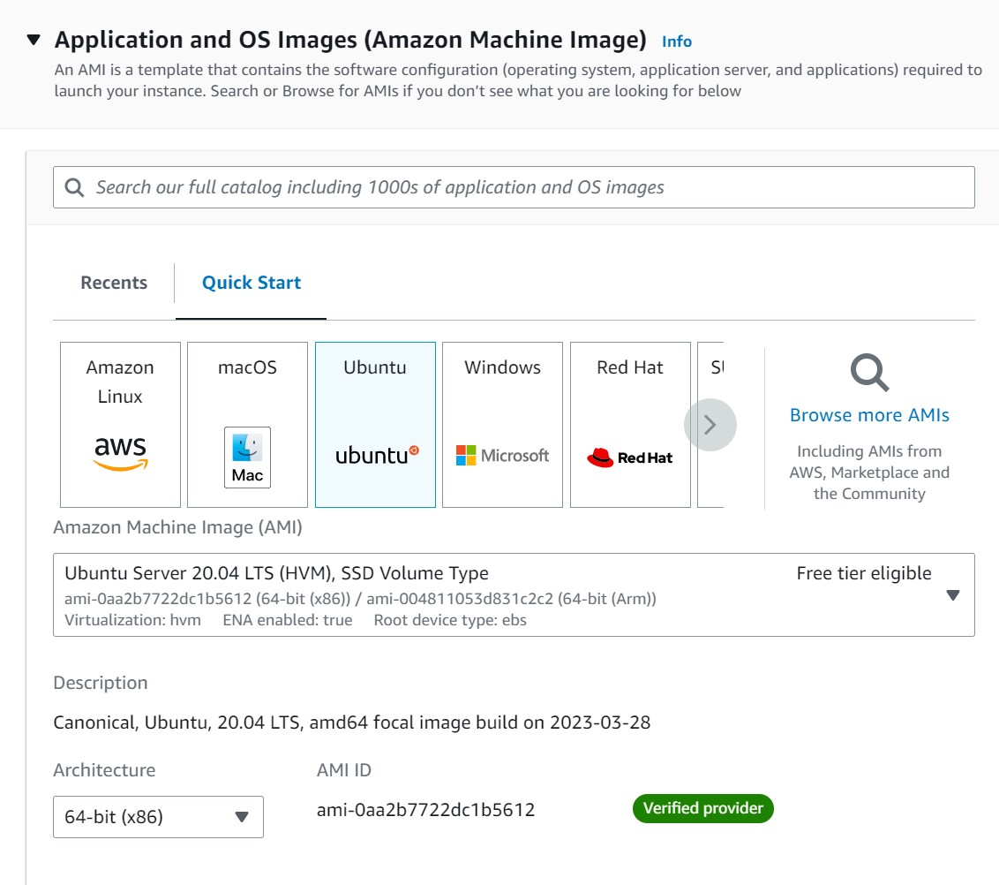
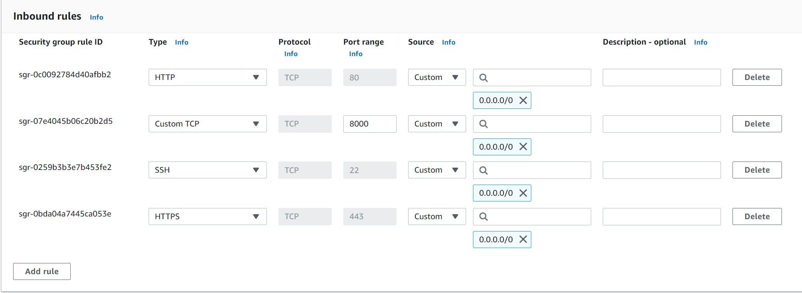
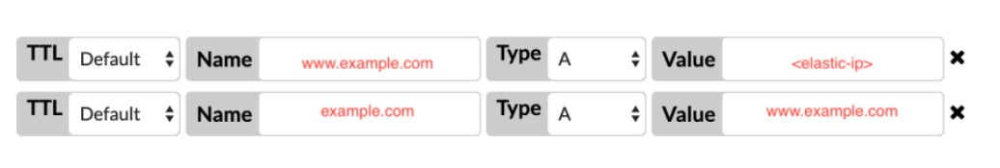

## Initial Setup:

These were the steps I followed when setting up the web server for the help desk. If for any reason the help desk needs to be redeployed follow these instructions.

1. Launch Ubuntu 20.04 LTS instance from AWS console
   1. Create a key-pair and download it for SSH access in next steps
      
2. Click on the newly provisioned instance from the list of instances
3. Click on ‘Security’
4. Click on the security group below “Security groups”
5. Add a security group rule with:
   2. Type: ‘Custom TCP’
   3. Port: 8000
   4. CIDR Block: 0.0.0.0/0
   
6. Return to instance overview
7. Click on the **Connect** button in the top right
8. Follow the instructions to connect via SSH.
9. Run `git clone https://github.com/teddyliang/Meta-Mesh-Help-Desk`
   1. This clones the help desk repository to our instance
10. Run  `sudo apt update`
11. Run  `sudo apt install python3-pip`
12. Run  `sudo apt install pipenv`
13. Run `sudo apt-get install lib`pq-dev
14. Run `pip3 install django`
15. Run `cd Meta-Mesh-Help-Desk`
16. Run `cd src`
17. Run `tmux`
18. Run `pipenv install`
19. Run `pipenv shell`
20. Run `python3 manage.py makemigrations`
21. Run `python3 manage.py migrate`
22. Run `python3 manage.py runserver 0.0.0.0:8000`
23. Visit the application at http:[EC2 IPV4]:8000
    1. EC2 IPV4 refers to the IPV4 address seen in the instance overview. It should look something like: `44.204.81.89`
24. Press Ctrl + B, then Ctrl + D to leave the web server running and exit.

## Making Changes:

1. Connect to the instance running the help desk via SSH.
2. Run  `cd Meta-Mesh-Help-Desk`
3. Run  git pull to get all code changes from the remote repo.
4. Run  `cd src`
5. Run  `pipenv install`
6. Run  `pipenv shell`
7. Run  `python3 manage.py makemigrations`
8. Run  `python3 manage.py migrate`
9. Run  `python3 manage.py runserver 0.0.0.0:8000`
10. Press Ctrl + A, then Ctrl + D to leave the web server running and exit.

## Managing Resources/Categories/Admins:

Resources, categories, and admins can all be updated and changed from the help desk UI.

1. Go to [http://44.204.81.89:8000/en/search/](http://44.204.81.89:8000/en/search/)
2. Click on staff login in the top right of the home page
3. Login using existing admin credentials
4. Click admin panel in the top right of the home page
5. Navigate the tabs on the left to view resources, categories, admins and more.

## Configuring the Domain:

[This guide](https://pythoncircle.com/post/699/using-a-custom-domain-for-django-app-hosted-on-aws-ec2 "How to configure EC2 instance domain") explains how to create a static elastic IP that you can then point your domain to. I've also added the high-level steps below, and already added [help.bringtheweb.org]() as an allowed host in the app settings.

1. Allocate an Elastic IP address and associate with the **help-desk** instance.
2. Add an A record for the elastic IP address in the domain's DNS records.
   1. This will require going to your domain registrar's website, i.e. Google Domains,  Namecheap, etc.

      
3. If using a domain other than [help.bringtheweb.org](), add it to the list of `ALLOWED_HOSTS` located in `src/helpdesk_proj/settings.py`.

## Backing Up the Database

In order to backup the sqlite database running our instance, we can directly copy the db.sqlite3 file to local. Then, to restore it to our instance, all we have to do is copy it back to our `Meta-Mesh-Help-Desk/src` directory. 

1. From the command line, navigate to the directory with our instance ssh key `help-desk-key.pem`
2. Run `scp -i help-desk-key.pem ubuntu@ec2-44-204-81-89.compute-1.amazonaws.com:~/Meta-Mesh-Help-Desk/src/db.sqlite3 \local\path\here`

   1. You'll need to specify where on your local computer you want the backup stored in the command. Replace the last path with that location.

## Restoring the Database

In order to restore the database, we'll upload the local backup we copied over in the previous step. 

1. From the command line, navigate to the directory with our instance ssh key `help-desk-key.pem`
2. Run `scp -i help-desk-key.pem \local\path\to\db.sqlite3 ubuntu@ec2-44-204-81-89.compute-1.amazonaws.com:~/Meta-Mesh-Help-Desk/src`
   1. You'll need to specify where on your local computer you stored the backup of the db. Replace the first path with that location.
